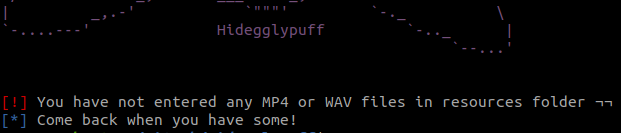
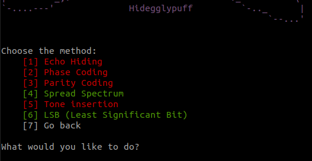
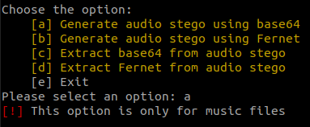

<h1 align="center">
  <br>
  <a href="https://github.com/Sawyer13/Hidegglypuff/"></a>
  <br>
  Hidegglypuff
  <br>
</h1>

<h4 align="center">Imagine for a moment if you could store sensitive information in simple audio tracks. Wouldn't that be cool? </h4>

<p align="center">
  
  </a>
  
</p>

## Prerequisites
You must have installed python 3 and the following packages.

## Features
Now, this tool only accept the following audio files:
  - [x] WAV
  - [ ] MP3

Also, this tool use the following methods to hide information:
  - [ ] Insertion-Based
  - [x] Substitution-Based
  - [ ] Generation-Based

Finally, the audio steganography techniques used in our tool are the follownig:
  - [ ] Echo Hiding
  - [ ] Phase Coding
  - [ ] Parity Coding
  - [x] Spread Spectrum
  - [ ] Tone insertion
  - [x] LSB (Least Significant Bit)

## Installation
The command to download it is:
```sh
git clone https://github.com/Sawyer13/Hidegglypuff
```

To install all the modules execute the following command:
```
pip install -r requirements.txt
```

All in one:
```
git clone https://github.com/Sawyer13/Hidegglypuff
cd Hidegglypuff
pip3 install -r requirements.txt
```

## How to use it
When you run the application for the first time, it checks if the following folders exist and, if they do not, it creates them:
* **resources:** this folder will contain the files on which stealth techniques are to be used.There must be at least one ".wav" or ".mp4" file.  In turn, the maximum number of files allowed is one ".wav" and one ".mp4". If you want another song or video, you must replace the original with the new one.
* **media**: this folder will contain the results. By default, it should be empty.
* **tmp**: this folder will contain temporary files generated by the tool. It will always be empty, except when running.

Once the application is started, and the contents of the **resources** folder are detected, the user is allowed to choose the steganography method to be used. 

<div align=center>
  
</div>

Any errors in the files would be displayed on the screen and the user would be ejected from the program.
Once the method has been chosen, the different encryption options are presented:

<div align=center>
  
</div>

If method 2 has been chosen, the different techniques contained in this method will be displayed.

<div align=center>
  
</div>

It is important to note that the `Spread Spectrum` method implements both audio (".wav" files) and video (".mp4" files). If you choose the wrong option, the application will indicate the error.

<div align=center>
  
</div>

## Errors
### First posible error
If you have a file that is not a ".wav" file, you can convert it using the following command:
```sh
ffmpeg -i <non_wav_filename> <wav_filename> <wav_filename>
```

As shown below:
```sh
ffmpeg -i The-Afterparty.mp3 The-Afterparty.wav
```

### Second posible error
If you are using python version 3.0 or lower, modify the following line in the `spectro.py` file:

```sh
output.writeframes(data.tostring())
```

To the following line:
```sh
output.writeframes(data.tobytes())
```

## Authors
* [Sawyer13](https://github.com/Sawyer13/)
* [Montsedom96](https://github.com/Montsedom96/)
* [H13R0S](https://github.com/H13R0S/)
* [mbocos98](https://github.com/mbocos98)

## IMPORTANT
This steganography tool was created for purely educational purposes. The use of this tool for bad purposes is forbidden.
